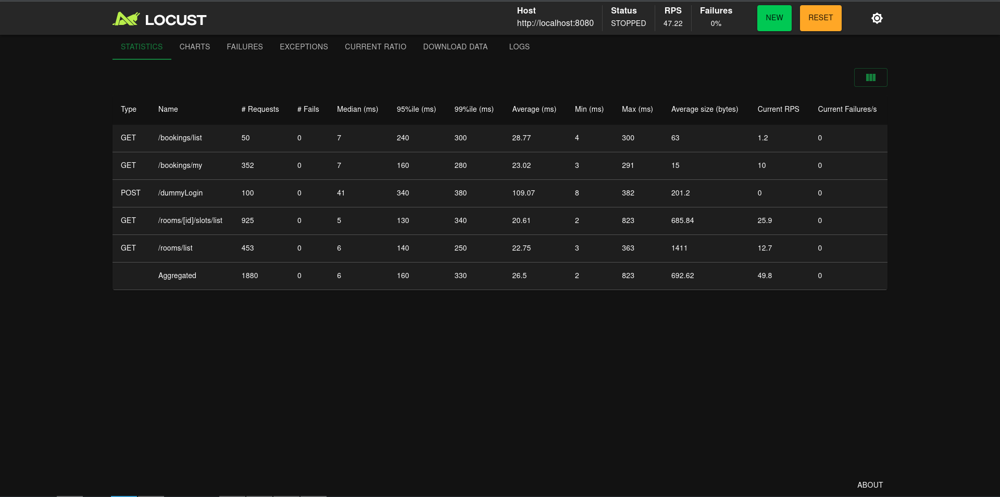

# Room Booking Service

Сервис бронирования переговорок. REST API на FastAPI + PostgreSQL + Redis, деплой через Docker Compose.

---

## Быстрый старт

```bash
cp .env.example .env      # настроить переменные окружения
docker compose up --build
```

Сервис доступен на `http://localhost:8080`.

---

## Стек

| Слой | Технология |
|---|---|
| Язык | Python 3.13 |
| Фреймворк | FastAPI |
| База данных | PostgreSQL 16 (asyncpg + SQLAlchemy 2.0 async) |
| Миграции | Alembic |
| Кеш | Redis 7 (redis-py async) |
| Авторизация | JWT (python-jose) |
| Пароли | passlib + bcrypt |
| Деплой | Docker Compose |
| Тесты | pytest + pytest-asyncio |
| Нагрузочное тестирование | Locust |

---

## Архитектура

Проект построен по принципам чистой архитектуры с разделением на четыре слоя:

```
src/
├── core/               # доменные модели и абстрактные репозитории
│   ├── domain/models.py
│   └── repositories.py
├── application/        # бизнес-логика (use cases), DTO, маперы
│   ├── use_case/
│   ├── dto/
│   └── mappers/
├── infrastructure/     # конкретные реализации: БД, JWT, Redis
│   ├── database/
│   ├── auth/
│   └── cache/
└── interfaces/         # HTTP-роутеры FastAPI
    └── api/
```

Зависимости направлены строго внутрь: `interfaces → application → core`. Инфраструктура реализует контракты из `core/repositories.py`. Use case-классы не знают ничего о HTTP и SQLAlchemy — только о доменных моделях из `core/domain/models.py`.

---

## Реализованный функционал

### Обязательное задание

**Администратор:**
- `POST /rooms/create` — создание переговорки (только admin)
- `POST /rooms/{roomId}/schedule/create` — создание расписания доступности (только admin)
- `GET /bookings/list` — список всех броней с пагинацией (только admin)

**Пользователь:**
- `GET /rooms/list` — список переговорок (admin и user)
- `GET /rooms/{roomId}/slots/list?date=YYYY-MM-DD` — доступные слоты по комнате и дате (admin и user)
- `POST /bookings/create` — создание брони (только user)
- `POST /bookings/{bookingId}/cancel` — отмена своей брони (только user)
- `GET /bookings/my` — список своих активных будущих броней (только user)

**Системные:**
- `GET /_info` — healthcheck, всегда возвращает 200
- `POST /dummyLogin` — выдача тестового JWT по роли (admin / user)

### Дополнительное задание

- `POST /register` — регистрация пользователя по email + пароль
- `POST /login` — авторизация по email + пароль с выдачей JWT
- Опциональная ссылка на конференцию при бронировании (`createConferenceLink: true`)
- Нагрузочное тестирование с Locust (`src/tests/locust/`)

---

## Бизнес-ограничения и их реализация

**Один слот — одна активная бронь.** Реализовано через частичный уникальный индекс на уровне PostgreSQL:
```sql
CREATE UNIQUE INDEX uq_booking_slot_active ON bookings (slot_id)
WHERE status = 'active';
```
Это гарантирует корректность даже при параллельных запросах без application-level блокировок.

**Слоты не пересекаются.** Длительность слота фиксирована — 30 минут. Функция `generate_slots_for_date` формирует слоты последовательно: начало следующего = конец предыдущего.

**Нельзя забронировать прошедший слот.** Проверяется в `CreateBookingUseCase.execute` — если `slot.start < datetime.now(UTC)`, возвращается `400`.

**Отмена идемпотентна.** В `CancelBookingUseCase.execute` — если статус уже `cancelled`, бронь возвращается без повторного обращения к БД.

**`/bookings/my` возвращает только будущие брони.** В `BookingRepository.get_my_bookings` фильтрация идёт через JOIN с таблицей `slots` по условию `Slot.start > now()`.

**Все даты в UTC.** `DateTime(timezone=True)` в SQLAlchemy-моделях, `datetime.now(timezone.utc)` везде в коде.

---

## Слоты: подход к генерации

Выбран подход **генерации по запросу (lazy generation)**.

Слоты не создаются заранее при создании расписания. При запросе `GET /rooms/{roomId}/slots/list?date=...` система:
1. Берёт расписание комнаты
2. Проверяет, входит ли запрошенная дата в дни недели расписания
3. Генерирует слоты на эту дату
4. Делает `bulk_upsert` с `ON CONFLICT DO NOTHING` — слоты имеют стабильные UUID через `uuid5(NAMESPACE, f"{room_id}:{slot_start.isoformat()}")`
5. Возвращает только свободные слоты (не занятые активной бронью)

Стабильные UUID гарантируют, что повторная генерация не создаёт дублей и `slotId` остаётся постоянным для бронирования.

### Почему не скользящее окно

Скользящее окно (заранее генерировать слоты на N дней вперёд) требует фоновой задачи и усложняет инфраструктуру. При данных объёмах (до 50 переговорок, до 1k слотов в день) генерация по запросу + кеш Redis полностью покрывают требование 200 мс SLI на самом нагруженном эндпоинте.

---

## Кеширование

Самый нагруженный эндпоинт — `GET /rooms/{roomId}/slots/list` — защищён Redis-кешем.

**Ключ:** `slots:{room_id}:{date}`  
**TTL:** 60 секунд  
**Инвалидация:** при создании брони и при её отмене кеш для соответствующей комнаты и даты сбрасывается через `invalidate_slots_cache`.

Для защиты от thundering herd (множество параллельных запросов при холодном кеше) используется Redis-distributed lock: первый запрос берёт блокировку, генерирует данные и кладёт в кеш; остальные ждут и читают уже готовый результат.

---

## Авторизация

JWT содержит `user_id` (UUID) и `role`. При создании брони `user_id` берётся исключительно из токена, не из тела запроса.

Эндпоинт `POST /dummyLogin` выдаёт токен по роли без проверки пароля. Для каждой роли фиксированный UUID:
- admin: `00000000-0000-0000-0000-000000000001`
- user: `00000000-0000-0000-0000-000000000002`

Это позволяет стабильно тестировать сценарии владельца брони.

---

## Ссылка на конференцию (дополнительное задание)

При `createConferenceLink: true` в теле запроса бронирования вызывается `_get_conference_link()` — мок внешнего конференц-сервиса, возвращающий URL вида `https://conference.exemple.com/room/{uuid}`.

**Принятые решения по сбоям:**

Возможные сценарии и их обработка:

1. **Внешний сервис недоступен** — бронь уже создана к этому моменту. Чтобы не оставлять бронь без ссылки молча, текущая реализация позволяет мок-сервису всегда отвечать успешно. В production здесь следует либо делать бронь атомарной с получением ссылки в одной транзакции (saga-паттерн с компенсацией), либо сохранять бронь без ссылки и ретраить получение асинхронно.

2. **Ошибка после успешного ответа сервиса** — ссылка получена, но бронь не сохранилась. Решение: получать ссылку после успешного `await self._bookings.create(...)`, а не до.

3. **Таймаут** — аналогично п.1, требует circuit breaker или fallback к созданию брони без ссылки с последующим уведомлением.

---

## Индексы базы данных

| Таблица | Индекс | Тип | Назначение |
|---|---|---|---|
| `users` | `ix_users_email` | unique | быстрый поиск при логине |
| `schedules` | `ix_schedules_room_id` | unique | гарантия одного расписания на комнату |
| `slots` | `ix_slots_room_id` | btree | фильтрация слотов по комнате |
| `slots` | `ix_slots_start` | btree | фильтрация по дате |
| `bookings` | `ix_bookings_slot_id` | btree | поиск брони по слоту |
| `bookings` | `ix_bookings_user_id` | btree | список броней пользователя |
| `bookings` | `uq_booking_slot_active` | partial unique | одна активная бронь на слот |

---

## Тестирование

### Запуск тестов

```bash
pytest --cov=src --cov-report=term-missing
```

### Структура тестов

```
src/tests/
├── jwt_test.py               # unit: создание и декодирование токенов
├── test_dto_schedule.py      # unit: валидация DTO расписания
├── usecase_booking_test.py   # unit: CreateBookingUseCase, CancelBookingUseCase
├── test_usecase_slots.py     # unit: generate_slots_for_date, GetAvailableSlotsUseCase
├── test_usecase_schedule.py  # unit: CreateScheduleUseCase
├── test_usecase_auth.py      # unit: DummyLoginUseCase, RegisterUseCase, LoginUseCase
├── integration_test.py       # E2E через HTTP: полные сценарии бронирования
└── locust/
    └── locustfile.py         # нагрузочное тестирование
```

### Конфигурация тестовой БД

Тесты используют отдельную БД, параметры которой задаются в `.test.env`. Файл `conftest.py` в корне проекта загружает его до любых импортов приложения и патчит `engine` + `session_factory` в существующем `db_helper`, чтобы все роутеры прозрачно работали с тестовой БД без изменения кода.

Redis в тестах заменяется `_FakeRedis` — in-memory реализацией с теми же методами (`get`, `setex`, `delete`, `lock`). Это позволяет запускать тесты без реального Redis.

### Покрытые сценарии (integration_test.py)

- Полный сценарий: создание комнаты → расписания → брони пользователем
- Отмена брони пользователем
- Идемпотентность отмены (повторная отмена возвращает 200)
- Попытка администратора создать бронь (ожидается 403)
- Двойное бронирование одного слота (ожидается 409)
- Повторное создание расписания (ожидается 409)
- Список комнат доступен авторизованному пользователю
- Неавторизованный запрос (ожидается 403)

---

## Нагрузочное тестирование

Файл: `src/tests/locust/locustfile.py`




Если фото не открывается, оно находится по пути img/locust.png

Запуск:
```bash
locust -f src/tests/locust/locustfile.py --host=http://localhost:8080
```

---

## Переменные окружения

| Переменная | Описание | Пример |
|---|---|---|
| `DB_USER` | пользователь PostgreSQL | `myuser` |
| `DB_PASSWORD` | пароль PostgreSQL | `mypassword` |
| `DB_HOST` | хост PostgreSQL | `db` |
| `DB_PORT` | порт PostgreSQL | `5432` |
| `DB_NAME` | имя базы данных | `mydatabase` |
| `DB_ECHO` | логирование SQL-запросов | `false` |
| `JWT_SECRET_KEY` | секрет для подписи JWT | `changeme` |
| `JWT_ALGORITHM` | алгоритм JWT | `HS256` |
| `ACCESS_TOKEN_EXPIRE_MINUTES` | время жизни токена | `30` |
| `REDIS_URL` | URL подключения к Redis | `redis://redis:6379/0` |

---

## Вопросы, решённые самостоятельно

**Когда генерировать слоты?**
Выбран подход генерации по запросу с `bulk_upsert ON CONFLICT DO NOTHING`. Альтернатива — скользящее окно с фоновым воркером — избыточна при заданных объёмах и усложняет инфраструктуру.

**Что делать, если у комнаты нет расписания?**
Возвращается пустой список слотов. Результат также кешируется, чтобы не нагружать БД повторными запросами к несуществующему расписанию.

**Как гарантировать уникальность слота при параллельных запросах?**
Через частичный уникальный индекс в PostgreSQL (`WHERE status = 'active'`). База данных является единственным source of truth — никакого optimistic locking на уровне приложения не нужно.

**Как обеспечить стабильные UUID слотов?**
`uuid5(NAMESPACE_DNS, "{room_id}:{slot_start_iso}")` — детерминированная генерация на основе комнаты и времени. Повторный запрос тех же слотов не меняет их идентификаторы.
